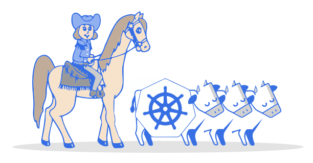

# Kubernetes User Group Myanmar Workshop

## Prequesties

- [Docker](https://docs.docker.com/install/)
- [Kind](https://github.com/kubernetes-sigs/kind)
Please make sure to up and running KIND on docker before workshop.

## WorkShop Links
* Workshop [Part-1](https://blog.k8smm.org/kind) (kind)

* Workshop [Part-2](https://blog.k8smm.org/clusters-as-cattle) (Clusters as Cattle)

